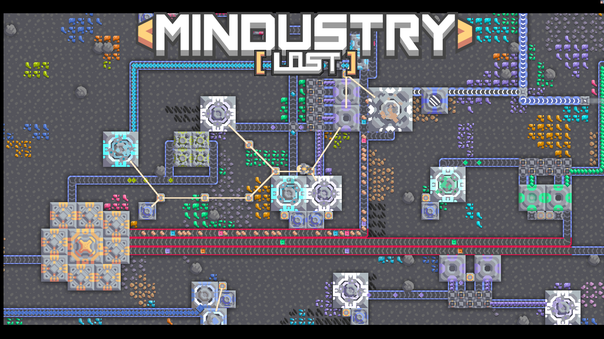

# ***Lost Expansion*** 

# *Mindustry Lost [EN]* 
## **Summary**

* [TodoList](https://github.com/NortonSa/Mindustry-Lost/blob/master/TODO.md)
* [Ideas](https://github.com/NortonSa/Mindustry-Lost)
* [Portuguese Version](#Pt-br)
* [Chinese Version](#Cn)
* [Russian Version](#Ru)

## How to install ?

1. Copy the name to your clipboard: `NortonSa/Mindustry-Lost`
2. open Mindustry on your device
3. open the `Mods` menu ->` Import github Mod`
4. Paste the text

## **description**

A mod focused on vanilla experience, all items added will be properly balanced for a better experience. So enjoy

### contribution
They will always be welcome, preferably sprites as they are the ones that take the longest, so if you want to contribute, the due credit will be mentioned
> Discord ***iow_(NortonSa) #5648***
# *Mindustry Lost [Pt-Br]*

## **Sumario**

* [TodoList](https://github.com/NortonSa/Mindustry-Lost/blob/master/TODO.md)
* [Ideas](https://github.com/NortonSa/Mindustry-Lost)
* [English Version](#en)
* [Chinese Version](#Cn)
* [Russian Version](#Ru)

## Como instalar ?

1. Copie o nome para sua área de transferencia:`NortonSa/Mindustry-Lost`
2. abra Mindustry em seu dispositivo
3. abra o menu  `Mods` -> `Import github Mod`
4. Cole o texto  

## **descrição**
	
Um mod focado em vanilla experience, todos os itens adicionados estarão devidamente balanceados para uma melhor experiência. Entao aproveite

### contribuição
Sempre serão bem vindas, de preferencia sprites pois são os que mais demoram, enfim caso queira contribuir será referido o devido credito
> Discord **_iow_NortonSa #5648_**

# *Mindustry Lost [RU] (Google_Translator)*

## ** Резюме **
* [TodoList](https://github.com/NortonSa/Mindustry-Lost/blob/master/TODO.md)
* [Идеи](https://github.com/NortonSa/Mindustry-Lost)
* [Chinese Version](#Cn)
* [English Version](#en)
* [Portuguese Version](#Pt-br)

## Как установить?

1. Скопируйте имя в буфер обмена: `NortonSa / Mindustry-Lost`
2. откройте Mindustry на вашем устройстве
3. открыть меню `Mods` ->` Import github Mod`
4. Вставьте текст

## ** описание **

Мод, ориентированный на опыт ванили, все добавленные предметы будут должным образом сбалансированы для лучшего опыта. Так что наслаждайтесь

### вклад
Они всегда будут приветствоваться, желательно спрайты, так как они занимают больше всего времени, поэтому, если вы хотите внести свой вклад, будет упомянуто должное
> Discord **_iow_NortonSa #5648_**

# *Mindustry Lost [CN] (Google_translator)*

## **摘要**
* [TodoList](https://github.com/NortonSa/Mindustry-Lost/blob/master/TODO.md)
* [想法](https://github.com/NortonSa/Mindustry-Lost)
* [English Version](#en)
* [Portuguese Version](#Pt-br)
* [Russian Version](＃Ru)

## **如何安装？**

1. 将名称复制到剪贴板: `NortonSa/Mindustry-Lost`
2. 在您的设备上打开 Mindustry
3. 打开 `Mods`菜单->`Import github Mod`
4. 粘贴文字

## **说明**

一个专注于香草体验的mod，所有添加的物品都会得到适当的平衡，以获得更好的体验。 所以享受

### 贡献
他们将始终受到欢迎，最好是sprite，因为它们是使用时间最长的sprite，因此，如果您要捐款，将会提及应有的信誉
>不和谐 **_iow_NortonSa＃5648_**
